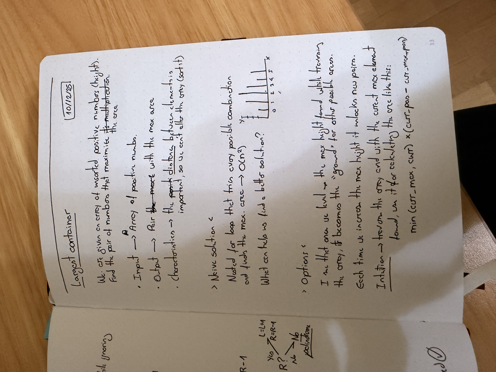
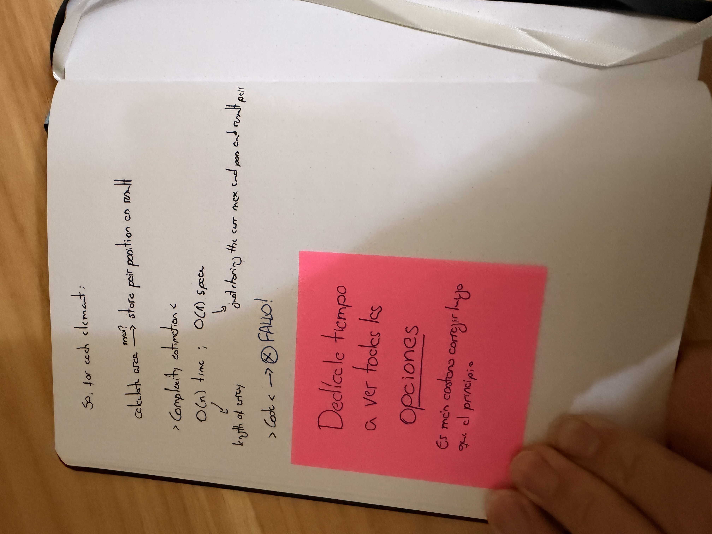

# Largest container problem

## Metrics
* Time taken: 45min
* Solved within time?: NO

## Statement
You are given an array of numbers, each representing the height of a vertical line on a graph.

A container can be formed with any pair of these lines, along with the X-axis of the graph.

Return the amount of water which the largest container can hold.

## Notes taken

